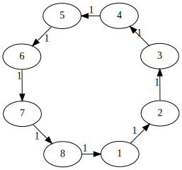
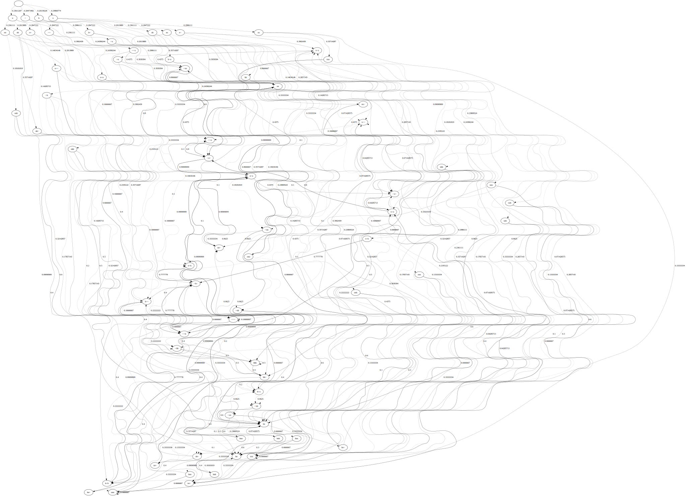
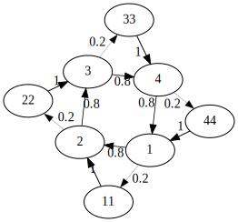
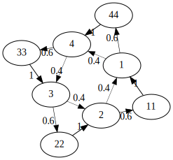
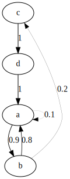
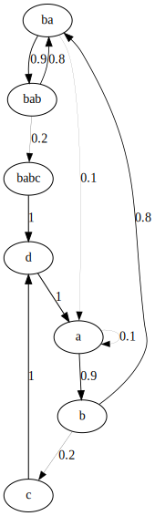
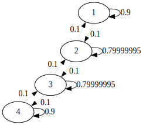

# Mégra Function Reference

Table of contents is grouped by categories, list below is sorted alphabetically.

Table of Contents
=================

**Generator Generators**:

Create basic event sequence generators.

* [cyc - Cycle Generator](#cyc---cycle-generator)
* [chop - Chop a sample](#chop---chop-a-sample)
* [friendship - Create Friendship (or Windmill) Generator](#friendship---create-friendship-generator)
* [flower - Create Flower Generator](#flower---create-flower-generator)
* [fully - Create Fully Connected Generator](#fully---create-fully-connected-generator)
* [infer - Infer Generator from Rules](#infer---infer-generator-from-rules)
* [learn - Learn Generator from Distribution](#learn---learn-generator-from-distribution)
* [lin - Simple Linear Sequence](#lin---simple-linear-sequence)
* [loop - Simple Loop Generator](#loop---simple-loop-generator)
* [nuc - Nucleus Generator](#nuc---nucleus-generator)
* [stages - Arrange an Event Sequence in Stages](#stages---stages-generator)

**Generator Modifiers**:

Generator Modifiers modify structure, weights or evaluation order/speed of basic generators.

* [blur - Blur Probabilities](#blur---blur-probabilities)
* [discourage - Stir Up Generator](#discourage---stir-up-generator)
* [encourage - Consolidate Generator](#encourage---consolidate-generator)
* [grow - Enlarge Generator](#grow---enlarge-generator)
* [haste - speed up evaluation](#haste---speed-up-evaluation)
* [life - Manipulate Generator](#life---manipulate-generator)
* [relax - Slow Down Generator](#relax---slow-down-generator)
* [rewind - Rewind Generator](#rewind---rewind-generator)
* [sharpen - Sharpen Probabilities](#blur---sharpen-probabilities)
* [shrink - Shrink Generator](#shrink---shrink-generator)
* [skip - Skip Events](#skip---skip-events)
* [solidify - Solidify Generator](#solidify---solidify-generator)
* [reverse - Reverse generator](#reverse---reverse-generator)

**Generator Multipliers**:

Generator Multipliers duplicate basic generators, eventually applying modifiers (generator or event stream modifiers).

* [xdup - Multiply Generators with Modifiers](#xdup---multiply-generators-with-modifiers)
* [xspread - Multiply Generators with Modifiers, Spread over Loudspeakers](#xspread---multiply-generators-with-modifiers-and-spread-over-channels)
* [ls - Create Generator List](#ls---create-generator-list)

**Parameter Modifiers**:

Dynamic parameters.

* [brownian - Bounded Brownian Motion](#brownian---bounded-brownian-motion)   
* [env - Parameter Envelope](#env---parameter-envelope)
* [exh - Event Stream Manipulator](#exh---event-stream-manipulator)
* [fade - Parameter Fader](#fade---parameter-fader)
* [inh - Event Stream Manipulator](#inh---event-stream-manipulator)
* [bounce - Parameter Oscillator](#bounce---parameter-oscillator)

**Applicators**:

Apply modifications to generators or the event stream that passes through. Count- or probability based. 

* [pear - Apply Event Modifiers](#pear---apply-event-modifiers)
* [apple - Probability-Based Generator Manipulators](#apple---probability-based-generator-manipulators)
* [every - Count-Based Generator Manipulators](#every---count-based-generator-manipulators)

**Misc**:

Helpers, session management, etc.

* [cmp - Compose Generators](#cmp---compose-generators)
* [clear - Clear Session](#clear---clear-session)     
* [control - Control Functions](#ctrl---control-functions)
* [sx - Event Sinks](#sx---multiple-event-sinks)
* [export-dot - Export to DOT File](#export-dot---export-to-dot-file)
* [defpart - Define Parts](#defpart---define-parts)
* [step-part - Evaluate Parts Step by Step](#step-part---evaluate-parts-step-by-step)

Alphabetical Function List
==========================

## `apple` - Probability-Based Generator Manipulators

Modify a generator with a certain probability

### Example

```lisp
(sx 'ba #t 
    (apple :p 10 (skip 2) :p 9 (rewind 2) ;; skip with probability of 10%, rewind with chance of 9%
        (cyc 'ba "bd ~ hats ~ sn ~ hats ~")))
```

## `blur` - Blur Probabilities

Distributes the weights more evenly, so that the generated sequence becomes less predictable.

### Syntax

`(blur <blur factor>)`

### Parameters 
* `blur factor` - amount of blurriness, where 0.0 has no effect and 1.0 blurs a lot.

### Example

```lisp
;; infer a loop with occasional repetitions
(sx 'con #t 
  (infer 'duct :events 
    'a (saw 'a2)
    'b (saw 'f2)
    'c (saw 'c3)
    :rules 
      (rule 'a 'a 10 200) 
      (rule 'a 'b 90 200) 
      (rule 'b 'b 10 400) 
      (rule 'b 'c 90 400) 
      (rule 'c 'c 10 100) 
      (rule 'c 'a 90 100)))
```

 

```lisp
;; now blur
(sx 'con #t 
  (blur 0.8 
    (infer 'duct :events 
      'a (saw 'a2)
      'b (saw 'f2)
      'c (saw 'c3)
      :rules 
          (rule 'a 'a 10 200) 
          (rule 'a 'b 90 200) 
          (rule 'b 'b 10 400) 
          (rule 'b 'c 90 400) 
          (rule 'c 'c 10 100) 
          (rule 'c 'a 90 100))))
```

 

```lisp
;; you can use blur over time, too
(sx 'con #t 
  (every :n 10 (blur 0.1) ;; blur every 10 steps
    (infer 'duct :events 
      'a (saw 'a2)
      'b (saw 'f2)
      'c (saw 'c3)
      :rules 
          (rule 'a 'a 10 200) 
          (rule 'a 'b 90 200) 
          (rule 'b 'b 10 400) 
          (rule 'b 'c 90 400) 
          (rule 'c 'c 10 100) 
          (rule 'c 'a 90 100))))
```

## `brownian` - Bounded Brownian Motion 

Define a bounded brownian motion on a parameter.

### Parameters

* lower boundary (float)
* upper boundary (float)
* `:wrap` (boolean) (t) - wrap value if it reaches lower or upper boundary
* `:step` (float) (0.1) - step that the parameter will be incremented/decremented

### Syntax

```lisp
(brownian <lower boundary> <upper boundary> :wrap <wrap> :step <step-size>)
```

### Examples
	
```lisp
(sx 'some #t
    (cmp (pear (rate (brownian 0.8 1.2)))
         (nuc 'bass (saw 120 :dur 200))))
```

## `chop` - Chop a sample

Chop a sample into parts, that will be played as a loop. All other parameters of 
a loop can be applied (`rep`, `max-rep` and `rnd`).

### Examples

```lisp
;; chop violin sample into 8 parts (each of which is 200ms long)
(sx 'some #t
  (chop 'chops 8 (violin 'a3 :sus 200))) 
```

## `clear` - Clear Session

Stops and deletes all present generators.

### Examples

```lisp
(sx 'some #t
  (cyc 'bear "bd ~ hats ~ sn ~ hats ~"))

(sx 'more #t :sync 'some
  (cyc 'bass "saw:100 ~"))

(clear) ;; clear everything
```

## `cmp` - Compose Generators

### Syntax
```lisp
(cmp <generators>)
```

### Examples

```lisp
;; The plain lisp approach would be:
(sx 'composed #t
    (pear (rev 0.1)
		(every :n 20 (haste 2 0.5)
			(cyc 'bl "bd ~ ~ sn ~ ~"))) )

;; this makes it somewhat inconvenient to add/disable certain parts.

;; With cmp, it can be re-written as:
(sx 'composed #t
    (cmp
		(pear (rev 0.1))
		(every :n 20 (haste 2 0.5))
		(cyc 'bl "bd ~ ~ sn ~ ~")
		))

;; now individual modifiers can easily be commented out

```

## `ctrl` - Control Functions

Executes any function, can be used to conduct execution of generators.

### Parameters

* function

### Syntax

```lisp
(ctrl <function>)
```

### Example

```lisp
;; define some parts
(defpart 'bass 	
		(nuc 'bass (saw 100)))
	
(defpart 'mid 
	(nuc 'midrange (saw 1000)))
	
(defpart 'treble 
	(nuc 'treble (saw 5000)))

;; Define a score, here as a learned one, even 
;; though any other generator might be used.
(sx 'ga #t 
	(learn 'ta 
		:events
		'a (ctrl (sx 'ba #t 'bass))
		'b (ctrl (sx 'ba #t 'mid))
		'c (ctrl (sx 'ba #t 'treble))
		:sample "ababaabbababcabaababaacabcabac"
		:dur 2400))
```

## `cyc` - Cycle Generator

Generates a cycle (aka loop) from a simple sequencing language. You can specify parameters within the sequence language,
or placeholders. Also, you can specify deviations from the default duration between events within the sequencing language.
It might seem simple, but this is one of the most powerful generators in Mégra.

### Parameters

* name - generator name
* sequence - sequence description
* `:dur` - default space between events 
* `:rep` - probability of repeating an event
* `:max-rep` - limits number of repetitions
* `:rnd` - random connection probability (currently not working the way I expected it ...)
* `:map` - map events on parameters
* `:events` - use labeled events

### Syntax

```lisp
(cyc <name> :dur <duration> :rep <repetition probability> :max-rep <max number of repetitions> :rnd <random connection prob> <sequence>)
```

### Example 
```lisp
;; plain
(sx 'simple #t
  (cyc 'beat "bd ~ hats ~ sn ~ hats ~"))
```

 

```lisp
;; with a 40% chance of repetition, 2 times at max
(sx 'simple #t
    (cyc 'beat :rep 40 :max-rep 2 "bd ~ hats ~ sn ~ hats ~"))
```


```lisp
;; with labeled events
(sx 'simple #t	
	(cyc 'beat 
	:events 'a (bd) 'b (hats) 'c (sn)
	"'a ~ 'b ~ 'c ~ 'b ~"))
```

```lisp
;; with parameters and placeholder
(sx 'simple #t	
	(cyc 'beat 
	:map 'saw 
	"200 ~ 120 140 'a3")) ;; you can use frequencies or note names 
```

```lisp
;; with escape durations
(sx 'simple #t
	(cyc 'beat "bd ~ hats /100 hats /100 ~ sn ~ hats ~"))
```

```lisp
;; control cycles with other cycles
(sx 'control #t
	(cyc 'ba 
		:dur 1599 ;; switch just in time ... will run out of sync eventually
		:events
		'a (ctrl (sx 'controlled #t (cyc 'fa "bd sn")))
		'b (ctrl (sx 'controlled #t (cyc 'fa "hats hats")))
		"'a 'b 'a 'b"
		))
```

## `defpart` - Define Parts

Define parts, which are basically lists of generators that you can name.
Parts are not updated in the running sync contexts, that is, when you
modify the part, you have to re-evaluate the sync context as well.

### Syntax
`(defpart <part-id> <generator-list>)`

### Example

```lisp
(defpart 'drum-and-bass 
  (cyc 'drums "bd ~ sn ~")
  (nuc 'bass (saw 100)))
	
(defpart 'hats-and-mid 
  (cyc 'hats "hats hats ~ hats")
  (nuc 'midrange (saw 1000)))
	
(defpart 'treble-and-cym
  (cyc 'cym "cym ~ cym cym")
  (nuc 'treble (saw 2000)))

;; Define a score, here as a learned one, even 
;; though any other generator might be used.
(sx 'ga #t 
  (learn 'ta 
    :events 
    'a (ctrl (sx 'ba #t 'drum-and-bass))
    'b (ctrl (sx 'ba #t 'hats-and-mid))
    'c (ctrl (sx 'ba #t 'treble-and-cym))
    :sample "ababaabbababcabaababaacabcabac"
    :dur 2400))
```

## `env` - Parameter Envelope

Define an envelope on any parameter. Length of list of levels must be one more than length of list of durations.
Durations are step based, so the absolute durations depend on the speed your generator runs at.

### Parameters

* `:v` or `:values` - level points on envelope path
* `:s` or `:steps` - transition durations (in steps)
* `:repeat` (boolean) - loop envelope 

### Syntax

```lisp
(env :values/:v <levels> :steps/:s <durations> :repeat <#t/#f>)
```

### Example

```lisp
(sx 'simple #t
    (cmp 
        (pear (lvl (env :v 0.0 0.4 0.0 :s 20 30)))
        (cyc 'beat "bd ~ hats ~ sn ~ hats ~")))
```

## `every` - Count-Based Generator Manipulators

Every so-and-so steps, do something with the generator or event stream.

### Examples

```lisp
(sx 'simple #t
    (cmp 
	    (every :n 20 (skip 2) :n 33 (rewind 2)) ;; <- every 20 steps, skip 2, every 33, rewind 2
        (cyc 'beat "bd ~ hats ~ sn ~ hats ~")))
```

## `exh` - Event Stream Manipulator

Exhibit event type, that is, mute all other events, with a certain probability.

### Parameters

* probablility (int) - exhibit probablility
* filter (filter function) - event type filter

### Syntax
```lisp
(exh <probability> <filter>)
```

### Example
```lisp
(sx 'simple #t 
  (cmp 
      (exh 30 'hats)
      (exh 30 'bd)
      (nuc 'beat (bd) (sn) (hats)))) 
```

## `export-dot` - Export to DOT File

Export a generator (or at least its underlying structure) to a DOT file that can be 
rendered with GraphViz.

## Syntax
`(export-dot <filename> <generator> or <keyword> and <tag list>)`

### Example
```
;; if a generator is provided, it will be exported as a DOT file directly
(export-dot "dotdotdot.dot"
	(cyc 'bu "saw ~ saw ~ saw ~"))
	
;; if the keyword "live" and a tag list are provided, all running generators matching the tag list will be exported
(sx 'ba #t 
  (cyc 'bu "bd ~ sn ~"))
  
(export-dot "babu" :live 'ba 'bu)

;; if a part is defined ... 
(defpart 'ga
	(cyc 'du "cym cym cym cym")
	(cyc 'ba "bd ~ sn ~"))
	
;; you can export it using the "part" keyword
(export-dot "partpart" :part 'ga)

```

## `fade` - Parameter Fader

Fade a parameter (sinusoidal).

### Syntax

`(fade <from> <to> :steps <steps>)`

### Example
```lisp

;; fade cutoff frequency
(sx 'osc #t
    (nuc 'ill (saw 300 :lp-freq (fade 300 2200 :steps 20))))

;; same, but a different position 
(sx 'osc #t
    (cmp
     (pear (lpf (fade 300 2200 :steps 4)))
     (nuc 'ill (saw 300))))

;; fade duration
(sx 'osc #t
    (nuc 'ill (saw 300) :dur (fade 100 400)))

;; fade probablility
(sx 'osc #tt
    (cmp
     (pear :p (fade 0 100) (lvl 0.0))
     (nuc 'ill (saw 300))))
```

## `friendship` - Create Friendship Generator

This creates a directed version of a Friendship- or Windmill graph.

### Syntax

`(friendship <name> :center <center event> :friends <list of events>)`

### Parameters

* `name` - the generator name
* `:center` - the center of the "social circle"
* `:friends` - the "friends".
* `:rep` - chance of repetition.
* `:max-rep` - maximum number of repetitions
* `:rnd` - generate random shortcuts
* `:events` - collect labeled events

### Example

```lisp
(sx 'friend #t
  (cmp
    (pear (atk 1) (rel 90) (sus 10) (rev 0.07))
      (friendship 'ship 
        :dur 100
		:center  (saw 'a2) 
        :friends (saw 'c3) (saw 'e3) (saw 'b3) (saw 'd3) (saw 'f3) (saw 'c4))))
```


## `flower` - Create Flower Generator

Create ... well, look at the examples.

### Syntax:
`(flower <name> :pistil <event> :layers <layers> :petals <events>)`

### Parameters:

* `name` - generator name
* `:layers` - number of layers
* `:pistil` - pistil or central event
* `:petals` - list of events (will be padded to appropriate lenght if necessary)

### Examples

```lisp
;; flower with one layer and four petals
(sx 'a-rose-is-a #t
  (flower 'rose 
    :pistil (saw 100)
    :petals (saw 200) (saw 300) (saw 400) (saw 150)))
```


Flower with 2 layers:
```lisp
(sx 'a-rose-is-a #t
  (flower 'rose 
    :layers 2
    :pistil (saw 100)
    :petals (saw 200) (saw 300) (saw 400) (saw 150) 
            (saw 400) (saw 600) (saw 800) (saw 300)))
```


## `fully` - Create Fully Connected Generator

Each node follows each other node with equal probablity ... so basically a random generator.

### Syntax
```lisp
(fully <name> :rest <list of events> :events <labeled events>)
```

### Example

```lisp
;; random generator with five events
(sx 'full #t
    (fully 'mel :rest (saw 'a3) (saw 'f2) (saw 'c3) (saw 'e3) (saw 'a4)))

```

    

## `grow` - Enlarge Generator

The growth algorithm allows adding information to an already existing generator.
It does so by picking an event the generator yielded in the past, shaking up the values
a little, and adding it to the generator following certain principles.

### Parameters

* `:var` (float) - variation factor (smaller -> less variation)
* `:method` (symbol) - growth method/mode (see below)
* `:durs` (list of ints) - durations to mix in
* `:rnd` (int) - chance to add random edges after growth

### Examples

```lisp
(sx 'al #t
	(every :n 10 (grow) 
		(nuc 'gae (sqr 120))))
```

### Modes

Each growth mode pushes the generator in a certain direction.

* `'default`
* `'triloop`
* `'quadloop`
* `'flower`
* `'loop` 

## `haste` - Speed Up Evaluation

Speed up evaluation for a specified number of steps, by a certain ratio.

### Examples

```lisp
(sx 'more #t
    (xspread     
     (cmp ;; this is another copy with modifiers ...
          (pear (freq-mul 3.0))
          (every :n 20 (haste 4 0.5))) ;; <- every 20 steps, double-time for four steps. Change to 0.25 for quadruple-time, etc
     ;; this is the "original" 
     (cyc 'one "tri:120 tri:90 tri:100 tri:120 ~ ~ ~ ~")))
```

## `inh` - Event Stream Manipulator

Inhibit event type, that is, mute event of that type, with a certain probability.

### Parameters

* probablility (int) - inhibit probablility
* filter (filter function) - event type filter

### Syntax

```lisp
(inh <probability> <filter>)
```

### Example

```lisp
(sx 'simple #t
  (cmp (inh 30 'hats)
       (inh 30 'bd)
       (inh 30 'sn)
       (nuc 'beat (bd) (sn) (hats))))
```

## `life` - Manipulate Generator

This is one of the more complex generator manipulations. To understand it, it's helpful to play around 
with the `(grow ...)` function first. What the `(life ...)` method does is basically the same, but automated
and bound to resources, in the fashion of a primitive life-modeling algorithm:

* There's a global pool of resources (which is just an abstract number).
* Each generator is assigned an amount of local resources (same as above).
* Each time the generator grows, it comes at a cost, which is subtracted first from the local, then from the global resources.
* If all resources are used up, nothing can grow any further.

Each symbol in the current alphabet is assigned an age (the number of times it has been evaluated), so at a certain, specified
age they can perish, freeing a certain amount of resources (which are added to the local resource pool).

Furthermore, if specified, the generator can be configured to "eat itself up" when a shortage of resources occurs. That means 
that an element will be removed before its time, freeing resources for further growth (which, again, are added to the local resources).

### Parameters

* growth cycle (int)
* average lifespan (int)
* variation (float)
* `:method` - growth method (see `(grow ...)`)
* `:durs` - list of possible durations to choose from
* `:apoptosis` (bool) - if `nil`, symbols never die
* `:autophagia` (bool) - if `t`, the generator will eat its own symbols to generate energy for further growth

```
;; define global resources
(global-resources 30000)
```

### Examples

The algorithm is quite configurable, but to use the default configuration, you can simply use:

```lisp
(sx 'the-circle #t
    (life 10 12 0.4 ;; first arg: growth cycle, second arg: average lifespan, third arg: variation factor
          (cyc 'of-life "tri:100 tri:120 ~ ~ tri:120 tri:180 ~ tri:200")))
```

This means that every ten steps the generator will grow, while the average lifespan of an element is 12 evaluations.
The a variantion factor of 0.4 will be applied when generating the new elements.

You can specify a growth method (see the paragraph on `(grow ...)` for details):

```lisp
(sx 'the-circle #t
    (life 10 12 0.4 :method 'flower
          (cyc 'of-life "tri:100 tri:120 ~ ~ tri:120 tri:180 ~ tri:200")))
```

To add some rhythmical variation, you can mix in other durations (chosen at random):

```lisp
(sx 'the-circle #t
    (life 10 12 0.4 :method 'flower :durs 100 200 200 200 400 100
          (cyc 'of-life "tri:100 tri:120 ~ ~ tri:120 tri:180 ~ tri:200")))
```

Another interesting way to use this is to juxtapose it with a static generator (note the reset flag is nil'd so
we can change parameters without starting from scratch every time):

```lisp
(sx 'the-circle #t
    (xspread
		(pear (freq-mul 1.5) (life 10 12 0.4 :method 'flower :durs 100 200 200 200 200 400))
		(cyc 'of-life "tri:100 tri:120 ~ ~ tri:120 tri:180 ~ tri:200")))
```

## `ls` - Create Generator List

If you want to modifiy multiple generators, you can collect them in a list.

### Example

```lisp
(sx 'ba #t
  (pear (rev 0.1) 
    (ls ;; thanks to ls, you can apply the reverb to everything at once 
      (cyc 'drum "bd ~ sn ~")
      (cyc 'bass "saw:'a1 ~ ~ ~"))))
```

## `nuc` - Nucleus Generator

Generates a one-node repeating generator, i.e. as a starting point for growing.

### Parameters

* name (symbol)
* event(s) (event or list of events) - events to be repeated
* `:dur` - transition duration between events

### Syntax

```lisp
(nuc <name> :dur <duration> <event(s)>)
```

### Example

```lisp
;; with one event
(sx 'just #t
  (nuc 'a-bassdrum :dur 400 (bd)))
  
;; with multiple events
(sx 'just #t
  (nuc 'a-bassdrum-and-a-snare :dur 400 (bd) (sn)))
```


## `bounce` - Parameter Oscillator

Define oscillation on any parameter. The oscillation curve is a bit bouncy, not really sinusoidal.

### Parameters 

* upper limit - upper limit for oscillation 
* lower limit - lower limit for oscillation 
* `:cycle` - oscillation cycle length in steps

### Syntax

```lisp
(bounce <upper limit> <lower limit> :cycle <cycle length in steps>)
```

### Example

```lisp
(sx 'simple #t
  (nuc 'beat (bd) :dur (bounce 200 600 :steps 80)))
```

## `infer` - Infer Generator from Rules

Infer a generator from arbitrary rules. Make sure every event has
at least one exit, otherwise the generator will stop.

Also, exit probablities for each node should add up to 100.

### Parameters

* `name` - generator name
* `:events` - labeled event mapping
* `:rules` - transition rules - Format `(rule <source> <destination> <probability> <duration (optional)>)`

### Example

```lisp
;; infer 
(sx 'con #t 
  (infer 'duct :events 
    'a (saw 'a2)
    'b (saw 'f2)
    'c (saw 'c3)
    'd (saw 'e4)
    :rules 
    (rule 'a 'a 80 200) ;; repeat 'a with 80% chance
    (rule 'a 'b 20 200) ;; move to 'b with 20% chance
    (rule 'aaa 'c 100 200) ;; after 3 repetitions of 'a, always move to 'c
    (rule 'b 'b 100 400) ;; repeat 'b always
    (rule 'bb 'd 100 400) ;; ... well, 2x max
    (rule 'c 'c 100 100) ;; same for 'c
    (rule 'ccc 'a 100 400) 
    (rule 'd 'd 80 200) ;; 'd is repeated with 80% chance as well
    (rule 'd 'a 20 200) ;; and moves back to 'a with 20% chance
    (rule 'ddddd 'b 100 400))) ;; and is repeated 5x max

```


## `learn` - Learn Generator from Distribution

Learn a generator from a sample string. Based on the variable-order Markov chain learning algorithm
proposed in *Ron, Singer, Tishby - The Power of Amnesia (1996)*.

### Parameters
* `:events` - Event definitions.
* `:sample` - Sample string to learn from. Uses the defined event mapping as characters.
* `:bound` - The maximum order of the learned markov chain, that is, how far to look back when determining the next step.
* `:epsilon` - Probability threshold, a connection that's less likely than that won't be learned. The higher, the longer it takes to learn.
* `:size` - Maximum generator size (nodes in the probabilistic finite automaton generated).
* `:autosilence` - Use `~` as default character for silence.

### Example
Learn a trap-like beat from a sample string.
```lisp
(sx 'from #t
  (learn 'data
    :events 'x (bd) 'o (sn) 'h (hats)
    :sample "xoxoxoxox~~o~h~~~h~h~h~~h~h~~hhh~x~o
             ~x~o~x~o~x~o~xh~h~~hhh~x~o~x~o~x~o~x
             ox~xox~xox~xoxo~xoxo~xoxox~oooo~xxxx
             ~xoxoxox~ohxhohxhohxhxhxhxhxhxhxhoho
             hoh"))
```


## `lin` - Simple Linear Sequence

If you just need a simple, linear sequence (no repetition), this is the way to go. This is 
great to write scores, using the linear sequence with control events to score other generators.

### Example

```lisp
;; default durations
(sx 'conductor #t
  (lin 'score 
    (ctrl (sx 'part #t (cyc 'ga "bd ~ sn ~"))) 4000
	(ctrl (sx 'part #t (cyc 'ga "bd hats sn hats"))) 4000
	(ctrl (sx 'part #t (cyc 'ga "[bd cym] cym [sn cym] cym"))) 4000
	(ctrl (clear))
	))

```

## `loop` - Simple Loop Generator

The `cyc` generator is a complex beast, pretty much a tiny language on its own. The loop generator is a 
very simple generator if you want a plain loop in a lisp-y syntax.

### Example

```lisp
;; default durations
(sx 'around #t
  (loop 'and-around (saw 100) (saw 200) (saw 300) (saw 400)))
  
;; custom durations
(sx 'around #t
  (loop 'and-around (saw 100) 400 (saw 200) 100 (saw 300) 200 (saw 400)))
```

## `pear` - Apply Event Modifiers

Appl-ys and Pears (don't ask me why it's named like this, I like good pears and found it funny).

### Example

```lisp
(sx 'ba #t
    (cmp
        (pear (freq-mul 1.5)) ;; <- always multiply frequency by 1.5
		(pear :p 10 (freq-mul 0.5) :p 20 (freq-mul 2.0)) ;; <- with a probablility of 10%, multiply with 0.5, and 20% multiply by two
		(pear :p 20 (rev 0.2)) ;; <- with a probability of 20%, apply reverb
		(pear :for 'sqr :p 20 (freq-mul 1.7)) ;; <- only for sqr events, apply a multiplicator with a chance of 20%
	    (cyc 'ta "saw:150 ~ sqr:100 ~ saw:150 ~ sqr:100")))
```

## `relax` - Slow Down Generator

Slows down generator for a specified number of steps, by a certain ratio.

### Examples

```lisp
(sx 'more #t
    (xspread     
     (cmp ;; this is another copy with modifiers ...
          (pear (freq-mul 3.0))
          (every :n 20 (relax 4 0.5))) ;; <- every 20 steps, half-time for four steps
     ;; this is the "original" 
     (cyc 'one "tri:120 tri:90 tri:100 tri:80 ~ ~ tri:120 tri:90 tri:100 tri:80 ~")))
```
## `reverse` - Reverse Generator

This function reverses every edge in the PFA. If you're a TidalCycles user, keep in mind that this works quite differently from TidalCycle's `rev`!
The generators will still have the same starting point, they will just move in the opposite direction. Especially if you use it with `cyc`, the
visual impression might be misleading.

### Example 

```lisp
;; let cycles run in opposite direcions, from the same starting point ...
(sx 'ba #t 
  (xspread
    (reverse)
    (cyc 'da "saw:100 ~ saw:200 saw:400")))
    
;; If you want to change the starting point (with the reversed generator starting on the last note),
;; you can skip forward:
(sx 'ba #t 
  (xspread
    (reverse (skip 3))
    (cyc 'da "saw:100 ~ saw:200 saw:400")))
```

```lisp
;; regular
(cyc 'da :rep 20 :max-rep 2 "saw:100 saw:200 saw:300 saw:400")
```




```lisp
;; reversed
(reverse (cyc 'da :rep 20 :max-rep 2 "saw:100 saw:200 saw:300 saw:400"))
```




## `rewind` - Rewind Generator

Re-winds the generator by a specified number of steps. The further unfolding might
be different from the previous one, obviously.

### Examples

```lisp
(sx 'more #t
    (xspread     
     (cmp ;; this is another copy with modifiers ...
          (pear (freq-mul 3.0))
          (every :n 20 (rewind 2))) ;; <- every 20 steps, rewind 2 steps (only the copy)
     ;; this is the "original" 
	 (cyc 'one "tri:120 tri:90 tri:100 tri:80 ~ ~ tri:120 tri:90 tri:100 tri:80 ~")))
```

## `shrink` - Shrink Generator
Removes a symbol from the generator's alphabet. While `grow` adds symbols based on 
the existing ones, this will remove them.

### Example
```lisp
;; this will grow faster than it shrinks
(sx 'ba #t
    (every :n 10 (grow 0.2) :n 20 (shrink) 
        (nuc 'ba (saw 120))))
```

## `skip` - Skip Events
Skips ahead a specified number of steps.

### Example

```lisp
(sx 'more #t
    (xspread     
     (cmp ;; this is another copy with modifiers ...
          (pear (freq-mul 3.0))
          (every :n 20 (skip 2))) ;; <- every 20 steps, skip 2 steps ahead (only the copy)
     ;; this is the "original" 
	 (cyc 'one "tri:120 tri:90 tri:100 tri:80 ~ ~ tri:120 tri:90 tri:100 tri:80 ~")))
```

## `solidify` - Solidify Generator
Looks at a generator's history of emitted symbols and adds a higher-order connection to make
the last sequence more likely to happen again.

### Example

```lisp
(defpart 'ga
  (every 
    :n 8 (solidify 4) ;; <- four last symbol emissions
    (infer 'ta :events 'a (sqr 550) 'b (sqr 200) 'c (sqr 300) 'd (sqr 400)
      :rules
      (rule 'a 'a 10 100)
      (rule 'a 'b 90 100)
      (rule 'b 'a 80 100)
      (rule 'b 'c 20 100)
      (rule 'c 'd 100 100)
      (rule 'd 'a 100 100) 
      )))

;; step 8 times
(step-part 'ga)
```
Initial generator:



After solidification:



## `stages` - Stages Generator
This generator arranges sound events in "stages". See for yourself.

### Syntax

`(stages <name> :pprev <prob> :pnext <prob> :dur <duration> <events>)`

### Parameters

* `name` - generator name
* `:dur` - duration between events
* `:pprev` - probability to return to previous stage
* `:pnext` - probability to advance to next stage
* `:cyc` - cyclical (last stage will advance to first stage)

### Example
```lisp
;; non-cyclical
(sx 'ba #t
  (stages 'ga :pprev 10 :pnext 10 (saw 100) (saw 200) (saw 300) (saw 400)))
```


```lisp
;; cyclical
(sx 'ba #t
  (stages 'ga :pprev 10 :pnext 10 (saw 100) (saw 200) (saw 300) (saw 400)))
```


## `step-part` - Evaluate Parts Step by Step

Define a part and evaluate it step by step. This exists mostly for debugging purposes.

### Example

```lisp
(defpart 'ba ;; <-- define some part
  (cyc 'hu "hats cym hats cym cym hats hats cym")
  (cyc 'du "bd ~ sn ~ bd bd sn ~"))

(step-part 'ba) ;; <-- step through ...
```

## `sx` - Event Sink

Short for `SyncconteXt`.

### Example

```lisp
(sx 'simple #t
  (nuc 'beat (bd) :dur 400))

(sx 'simple2 #t :sync 'simple :shift 200
  (nuc 'beat2 (sn) :dur 400))
  
;; you can solo and mute by tag ...
  
(sx 'solo #t :solo 'bd ;; <-- solo all events tagged 'bd'
  (nuc 'snare (sn) :dur 400)
  (nuc 'hats (hats) :dur 400)
  (nuc 'bass (bd) :dur 400))

(sx 'solo #t :block 'bd ;; <-- block all events tagged 'bd'
  (nuc 'snare (sn) :dur 400)
  (nuc 'hats (hats) :dur 400)
  (nuc 'bass (bd) :dur 400))
```

## `xdup` - Multiply Generators with Modifiers

If you want to juxtapose (obvious reference here) a generator with a modified copy of itself,
without re-writing the whole generator. 

### Example
```lisp
(sx 'more #t
    (xdup
     (cmp ;; this is the copy with modifiers ...
      (pear (freq-mul 2.0) (rev 0.1))
      (every :n 20 (haste 2 0.5)))     
     ;; this is the "original" 
     (cyc 'one "tri:'f3 tri:'a3 tri:'c4 tri:'e4 ~ ~ tri:'f3 tri:'a3 tri:'c4 tri:'e4 ~")))
```

## `xspread` - Multiply Generators with Modifiers and spread over Channels.

If you want to juxtapose (obvious reference here) a generator with a modified copy of itself,
without re-writing the whole generator. As opposed to `xdup`, this one spreads the copies over
the available loudspeakers/channels, or spatial spectrum (once binaural stereo or ambisonics are available).

### Example
```lisp
(sx 'more #t
    (xspread
     (cmp ;; this is the copy with modifiers ...
          (pear (freq-mul 2.0) (rev 0.1))
          (every :n 20 (haste 2 0.5)))
     (cmp ;; this is another copy with modifiers ...
          (pear (freq-mul 4.02) (rev 0.1))
          (every :n 20 (haste 3 0.5)))     
     ;; this is the "original" 
     (cyc 'one "tri:'f3 tri:'a3 tri:'c4 tri:'e4 ~ ~ tri:'f3 tri:'a3 tri:'c4 tri:'e4 ~")))
```


